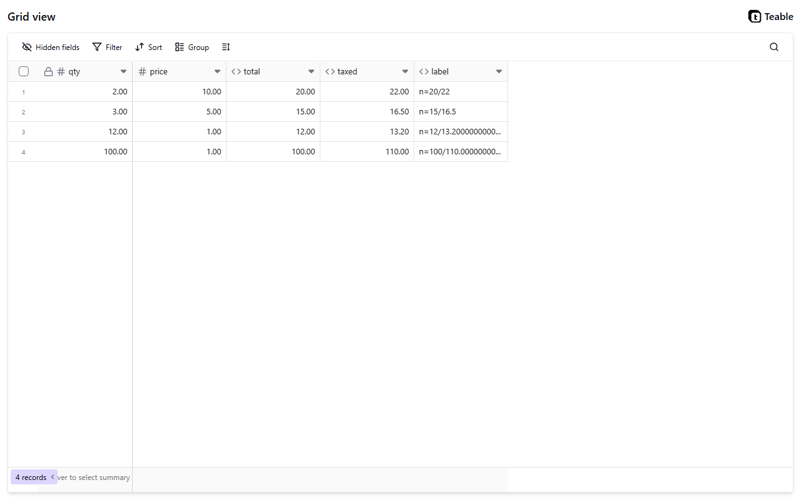

# teable-akka

Keeps a table's formula columns correct: when a cell changes, every formula that depends on
it is worked out again, in an order that never asks for a value before it exists.

A port of [teableio/teable](https://github.com/teableio/teable) onto **Akka**, built with
**Akka Specify**.



---

## Where it came from

teable is a spreadsheet-database: tables of records, where a column can hold a formula over
the other columns instead of a value someone typed. It was ported to derive a specification
format precise enough to regenerate a system on a different stack — the port is the vehicle,
the specification is the deliverable.

The specifications the port was generated from are in
[TylerJewell/akka-specify-harness](https://github.com/TylerJewell/akka-specify-harness) under
`teable-port/`.

---

## teableio/teable → this port

📉 5,468 TypeScript lines → **1,148 Java lines**<br>
📁 9 files → **11 files**<br>
🖥️ 3 processes → **1 process**<br>
⚡ 696.7 µs → **55.0 µs**, ordering 256 fields<br>
🎯 27 of 27 steps agreeing → **27 of 27 steps agreeing**<br>
⏳ cold start not measured → **not measured**<br>
💾 disk not measured on comparable terms → **not measured**

Full method and the numbers that did *not* make this list:
[`bench/REPORT.md`](https://github.com/TylerJewell/akka-specify-harness/blob/main/teable-port/bench/REPORT.md).

---

## What it took to build

⏱️ **29.3 hours** from the first command to the published repository, **4.3** of them active<br>
💬 **903** exchanges with the model<br>
✍️ **723,406** tokens written by the model, **253,684,669** counting everything sent and re-sent<br>
🙋 **0** questions to a human<br>
🧪 **95** tests

```bash
python toolkit/tokens.py --port teable    # turns, tokens, elapsed and active time
```

The record of every question, and where the time went, is in
[`port-log/`](https://github.com/TylerJewell/akka-specify-harness/tree/main/port-log).

---

## What it does

From the specification:

- **A formula's dependencies are the fields it names, and nothing else.** Naming the same
  field twice counts once, and naming a field the table does not have is refused when the
  formula is written rather than when it is worked out.
- **Fields are ordered so that nothing is worked out before what it needs.** Where two
  fields could be worked out at the same moment, the one declared first goes first, so the
  same table always gives the same order.
- **A formula that would make a loop is refused.** The refusal names the loop as a path
  through the fields, and the table is left exactly as it was.
- **One edit recomputes everything downstream of it, in one pass.** A change to a single
  cell moves through the whole chain of formulas that read it, and touches no other record.
- **A formula added to a table that already has records is worked out for all of them.**
  If it fails on any one of them, the field is not added at all.
- **Blank is not zero, and which of the two a function sees is part of the function.**
  Adding a blank treats it as zero; dividing by one gives blank; the largest of several
  numbers ignores blanks while their total does not.

---

## Design decisions

**Event sourcing.** A table is stored as the list of things that happened to it rather than
as the finished grid, so nothing has to be trusted to have been written down correctly at
the time. Any past state can be rebuilt by replaying that list from the start.

**One table, one unit.** All of a table's columns and rows are held together and changed
together, so an edit and everything it recomputes happen as one indivisible step. Nobody can
read a table halfway through and see a stale answer beside a fresh one.

**Ties broken by the order columns were declared.** When two columns could be worked out at
the same moment, the one written down first goes first, rather than whichever the program
happened to reach. The same table gives the same order every time, on any machine.

**A parser written by hand.** Reading a formula is done by three hundred lines written for
this, instead of twelve thousand generated from a grammar file. The whole of what the
program does with a formula can be read and changed by a person.

**Changes pushed to the screen.** The screen holds a connection open and is told when
something changes, instead of asking again every few seconds. A change shows up as fast as
it can travel, and nothing is sent at all while nothing is happening.

---

## Running it — the short path

You do not need Java, Maven, or the Akka CLI installed. Akka Specify installs them for you.

**1. Install Akka Specify** in Claude Code:

```
/plugin marketplace add akka/ai-marketplace
/plugin install akka@akka-ai-marketplace
```

Restart Claude Code when it asks.

**2. Give it this prompt:**

> Clone https://github.com/TylerJewell/teable-akka into a new directory and open it.
> Then run /akka:setup to install everything this project needs, and /akka:build to
> compile it, run the tests, and start it locally.

**3. Open** http://localhost:9082.

---

## Running it — the developer path

### Requirements

- Java 21 or newer
- Maven 3.9 or newer
- An Akka download token — run `akka code token` once
- Node 20 or newer and pnpm, only if you want the grid on screen as well as the data

### Start the service

```bash
mvn compile
akka local run
```

The service starts on **port 9082**.

### Start the grid

The grid under `webapp/` is teable's own, kept here in source form. Its installed
dependencies and build output are not, so build them once:

```bash
cd webapp
pnpm install
pnpm -F @teable/app build
node serve.js
```

Then open `http://localhost:3000/share/{tableId}/view` for a table this service holds.

---

## Model providers

This service calls no model. There is nothing to select and no key to set.

---

## Configuration

| Variable | Default | Notes |
|---|---|---|
| `akka.javasdk.dev-mode.http-port` | `9082` | Set in `application.conf`. Where the service listens when run locally. |

---

## Where it differs from teableio/teable

Everything not listed here behaves the same way on purpose, including the parts that look
like mistakes.

- **How the screen finds out about a change.** teable pushes changes to the grid over a
  long-lived two-way socket carrying edit operations. This port sends one-way messages down
  a held-open connection and has the grid re-read what changed, because a one-way channel is
  the whole of what a screen showing somebody else's edits needs.
- **What is missed while the connection is down.** teable's transport has no stated answer,
  and none is forced on it while nothing drops. This port re-reads the table's whole current
  state on reconnecting before it resumes listening, so a gap costs one extra read and never
  a missing change.
- **Which of the original's two formula engines is copied.** teable has two that give
  different answers on seven of the expressions measured here: one turns a formula into a
  database query, the other works it out in the program. This port follows the first,
  because it is the one an ordinary request reaches; against the second it would disagree,
  correctly.
- **Which of the original's two column orderers is copied.** teable also has two of these,
  and they break ties differently. This port follows the one a request for a new column
  reaches, which breaks ties on the order the columns were declared.
- **How large a table may get.** teable keeps records in a database and sets no limit here.
  This port holds a whole table together as one unit and refuses growth past 2,000 records,
  because everything held together has to be read and written together.
- **Where a shared view's address comes from.** teable keeps a separate register of shared
  views, each with its own address and its own rules about who may look. This port uses the
  table's own identifier as the address, because that register is a different capability
  from the one being compared.
- **What a refused formula says.** Both refuse the same formulas, and the messages this port
  gives back are teable's own words, taken either from the running original or from its
  source. Whether every one of them still reads the same in every case is **not checked**;
  which came from where is in [`ACKNOWLEDGEMENTS.md`](ACKNOWLEDGEMENTS.md).
- **Whether a column can be turned into one the database works out itself.** teable can do
  this for some columns, under conditions it decides. This port has no database to do it in,
  so the question does not arise; whether any answer would have differed is **not checked**.
- **How a choice between several fixed alternatives behaves on a numeric column.** What this
  port does was measured against the original and copied exactly, including a case nobody
  has explained. If the original changes it, the two will differ.
- **Adding up more than three numbers where one of them is blank.** The rule that a total
  including a blank is blank was measured with two numbers and with three, and this port
  applies it however many there are. Beyond three it is **not checked**.
- **Everything to do with columns that read from another table** — links, lookups and
  rollups — and everything to do with dates, times and lists of values. None of it was
  attempted here; `teable-port/docs/scope.md` in the harness says what was left out and why.

---

## Licence

teable is two licences at once. Its applications, including the grid vendored here under
`webapp/`, are AGPL-3.0; the packages this rebuild was written from are MIT. Both are
© 2023–2025 Teable, Inc. Because the grid is shipped here in source form, **this repository
is AGPL-3.0 as a whole**. The rebuild is a derived work in the ordinary sense: it was built
to agree with what the running original does. See
[`ACKNOWLEDGEMENTS.md`](ACKNOWLEDGEMENTS.md).
